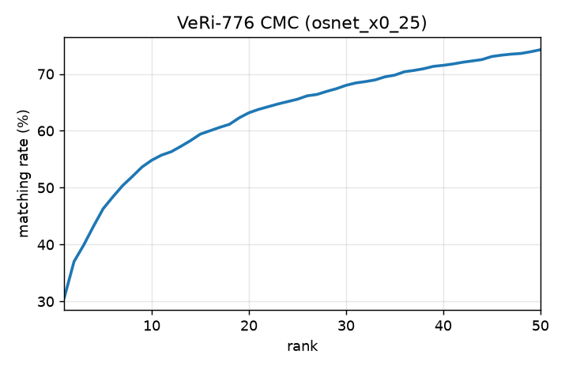
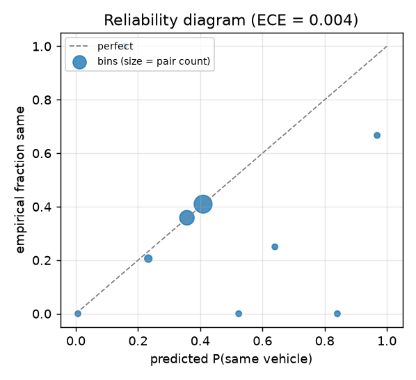
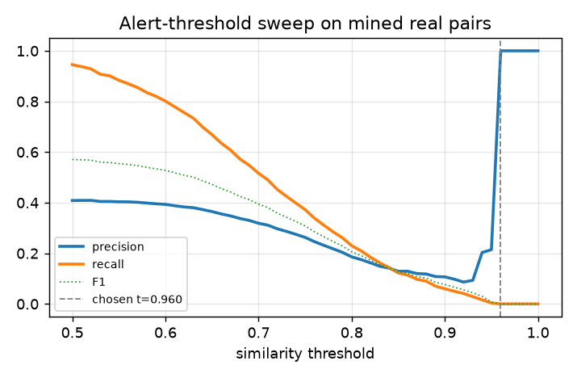
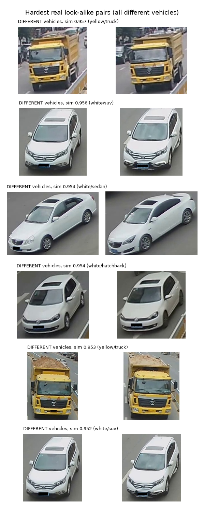
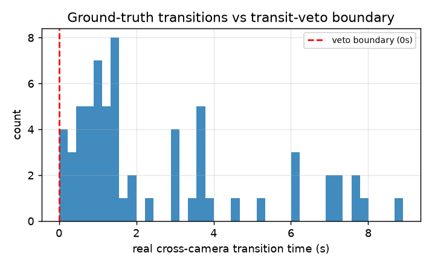
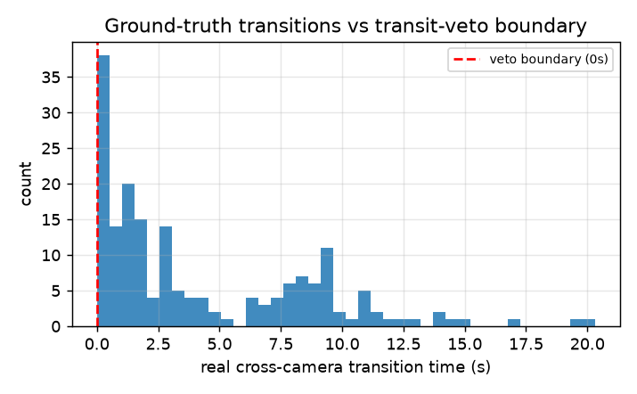
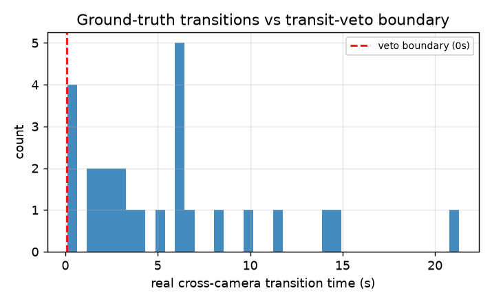
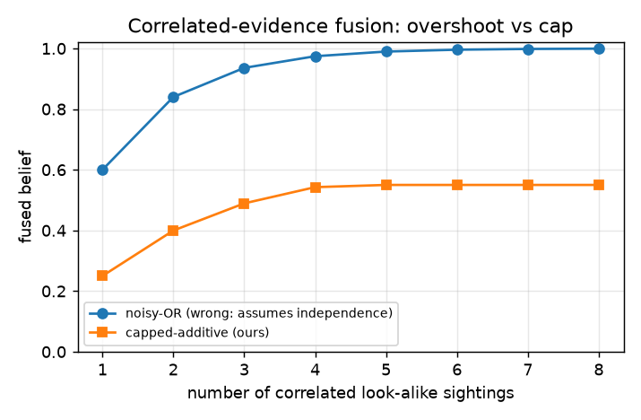

# RESULTS

*Regenerated by `python -m eval.run` on 2026-07-20 14:20. Every section is computed from data actually present on disk; missing datasets produce PENDING sections, never substituted numbers. Nothing here claims production accuracy — see the Limits section of the README.*

## VeRi-776: retrieval, calibration, ablation

Embeddings: osnet_x0_25 (torchreid, ImageNet-pretrained; VeRi-776-trained weights are a manual download — see README). 1678 query / 11579 gallery images, standard same-camera exclusion protocol.

### Retrieval

| Rank-1 | Rank-5 | Rank-10 | mAP | queries |
|---|---|---|---|---|
| 30.7% | 46.3% | 54.8% | 7.6% | 1678 |

### Calibration on mined real hard negatives

1998 pairs (800 hard negatives = same-color same-body different-vehicle, mined by bucket). Calibration version `isotonic-5b5046ab06`; ECE 0.004. Alert threshold 0.960 chosen for target precision 0.95; hard-negative FPR at that threshold: 0.0%.

### THE ABLATION: raw ReID alerting vs cascade + vetoes

Attribute channel uses the dataset's own labels (a perfect attribute classifier), so the cascade delta is an **upper bound** on what a real attribute head buys. Review-rate is the cost of refusing to guess.

| policy | precision | recall | F1 | alerts | false positives | reviews |
|---|---|---|---|---|---|---|
| raw | 100.0% | 0.0% | 0.0% | 0 | 0 | 0 |
| cascade | 100.0% | 0.0% | 0.0% | 0 | 0 | 0 |

**Delta: +0.0% precision; 0% of raw false positives eliminated by the attribute veto + look-alike ambiguity refusal.**

### Failure cases (honest, not curated away)

- No wrong alerts at the chosen threshold on this run.

## VehicleID: retrieval

**PENDING — dataset not present.** PKU VehicleID requires an emailed research request. See [DATASETS.md](DATASETS.md) for the request/download steps. This section is generated only from real data; nothing is simulated in its place.

## CityFlow: cross-camera validation

### Scenario S01 (5 cameras, 409 ground-truth tracks)

| check | result |
|---|---|
| real transitions wrongly vetoed | 3/31 (9.7%) |
| constructed impossible transitions caught | 24/31 (77.4%) |
| noisy-OR pushes past update threshold | 100% of 95 real multi-camera vehicles |
| capped-additive pushes past threshold | 0% (cap is below it by design) |

Impossible transitions are *constructed* (real pairs replayed faster than any observed vehicle) because CityFlow has no labeled false tracks; the table says exactly what was tested.

### Scenario S02 (4 cameras, 450 ground-truth tracks)

| check | result |
|---|---|
| real transitions wrongly vetoed | 2/84 (2.4%) |
| constructed impossible transitions caught | 76/84 (90.5%) |
| noisy-OR pushes past update threshold | 100% of 145 real multi-camera vehicles |
| capped-additive pushes past threshold | 0% (cap is below it by design) |

Impossible transitions are *constructed* (real pairs replayed faster than any observed vehicle) because CityFlow has no labeled false tracks; the table says exactly what was tested.

### Scenario S03 (6 cameras, 80 ground-truth tracks)

| check | result |
|---|---|
| real transitions wrongly vetoed | 3/12 (25.0%) |
| constructed impossible transitions caught | 12/12 (100.0%) |
| noisy-OR pushes past update threshold | 100% of 18 real multi-camera vehicles |
| capped-additive pushes past threshold | 0% (cap is below it by design) |

Impossible transitions are *constructed* (real pairs replayed faster than any observed vehicle) because CityFlow has no labeled false tracks; the table says exactly what was tested.

## 3D-geometry ablation (car3d bridge)

**PENDING — requires a real cargen image-to-3D backend (SF3D/TRELLIS — the stub prior emits a procedural sedan whose geometry is meaningless for identification).**

Planned, code in place (`eval/ablation.py` `extra_attrs` hook + `car3d/geometry.py`): (a) cascade precision with vs without 3D-derived proportion attributes on cross-VIEW query/gallery pairs, where 2D ReID degrades most; (b) geometry error vs number of fused sightings, to substantiate — or refute — the claim that the model firms up with corroboration. Both will be reported even if the gain is small or absent.

## SYNTHETIC adversarial fixture: the independence trap (not real data)

Deterministic unit-level demonstration on the synthetic world's correlated look-alikes (the same invariant is validated on real CityFlow transitions above when that dataset is present):

- eight correlated appearance-only sightings, capped-additive belief: `[0.25, 0.4, 0.489, 0.543, 0.55, 0.55, 0.55, 0.55]` — never exceeds the appearance cap 0.55 < update threshold 0.75;
- the same eight sightings under noisy-OR (p=0.6 each): `0.99934` — false near-certainty.
