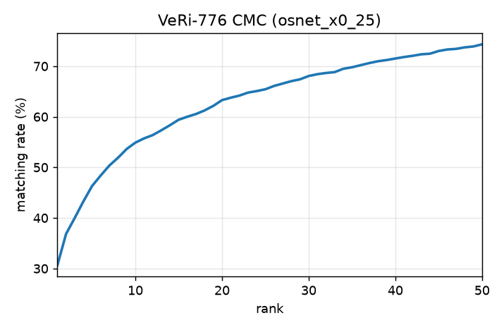
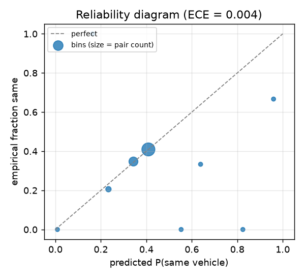
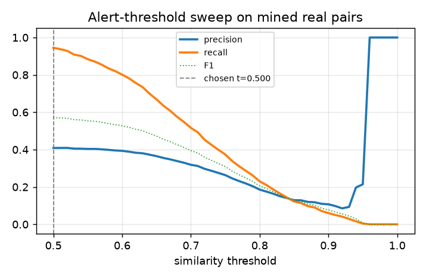
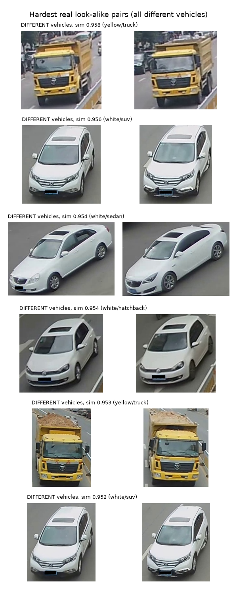
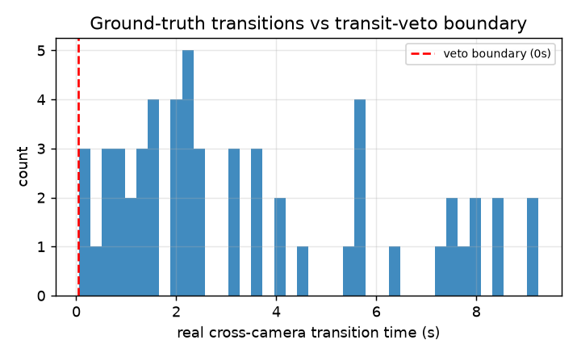
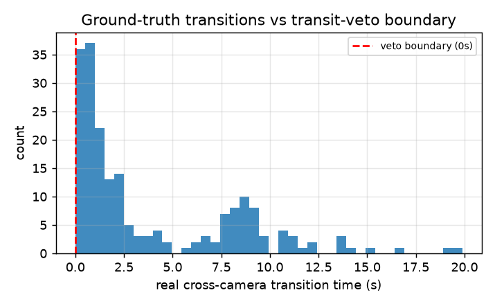
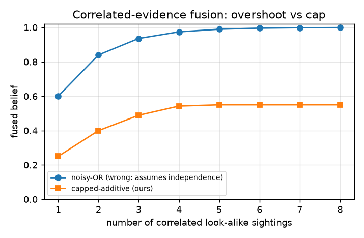
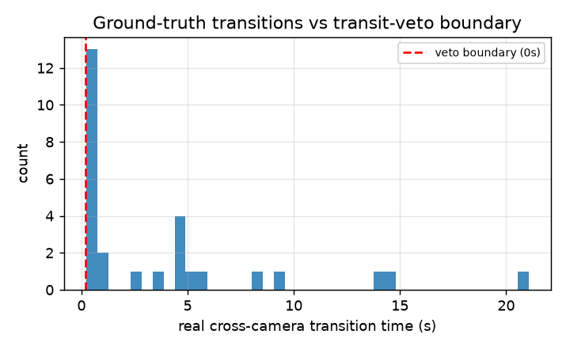

# RESULTS

*Regenerated by `python -m eval.run` on 2026-07-24 21:44. Every section is computed from data actually present on disk; missing datasets produce PENDING sections, never substituted numbers. Nothing here claims production accuracy — see the Limits section of the README.*

## VeRi-776: retrieval, calibration, ablation

Embeddings: osnet_x0_25 (torchreid, ImageNet-pretrained; VeRi-776-trained weights are a manual download — see README). 1678 query / 11579 gallery images, standard same-camera exclusion protocol.

### Retrieval

| Rank-1 | Rank-5 | Rank-10 | mAP | queries |
|---|---|---|---|---|
| 30.7% | 46.3% | 54.8% | 7.6% | 1678 |

### Calibration on mined real hard negatives

1998 pairs (800 hard negatives = same-color same-body different-vehicle, mined by bucket). Calibration version `isotonic-5b5046ab06`; ECE 0.004. Alert threshold 0.960 chosen for target precision 0.95; hard-negative FPR at that threshold: 0.0%.

### THE ABLATION: raw ReID alerting vs cascade + vetoes

Attribute channel uses the dataset's own labels (a perfect attribute classifier), so the cascade delta is an **upper bound** on what a real attribute head buys. Review-rate is the cost of refusing to guess.

| policy | precision | recall | F1 | alerts | false positives | reviews |
|---|---|---|---|---|---|---|
| raw | 100.0% | 0.0% | 0.0% | 0 | 0 | 0 |
| cascade | 100.0% | 0.0% | 0.0% | 0 | 0 | 0 |

**Delta: +0.0% precision; 0% of raw false positives eliminated by the attribute veto + look-alike ambiguity refusal.**

### Failure cases (honest, not curated away)

- No wrong alerts at the chosen threshold on this run.

## VehicleID: retrieval

**PENDING — dataset not present.** PKU VehicleID requires an emailed research request. See [DATASETS.md](DATASETS.md) for the request/download steps. This section is generated only from real data; nothing is simulated in its place.

## CityFlow: cross-camera validation

### Scenario S01 (5 cameras, 409 ground-truth tracks)

| check | result |
|---|---|
| real transitions wrongly vetoed | 3/31 (9.7%) |
| constructed impossible transitions caught | 24/31 (77.4%) |
| noisy-OR pushes past update threshold | 100% of 95 real multi-camera vehicles |
| capped-additive pushes past threshold | 0% (cap is below it by design) |

Impossible transitions are *constructed* (real pairs replayed faster than any observed vehicle) because CityFlow has no labeled false tracks; the table says exactly what was tested.

### Scenario S02 (4 cameras, 450 ground-truth tracks)

| check | result |
|---|---|
| real transitions wrongly vetoed | 2/84 (2.4%) |
| constructed impossible transitions caught | 76/84 (90.5%) |
| noisy-OR pushes past update threshold | 100% of 145 real multi-camera vehicles |
| capped-additive pushes past threshold | 0% (cap is below it by design) |

Impossible transitions are *constructed* (real pairs replayed faster than any observed vehicle) because CityFlow has no labeled false tracks; the table says exactly what was tested.

### Scenario S03 (6 cameras, 80 ground-truth tracks)

| check | result |
|---|---|
| real transitions wrongly vetoed | 3/12 (25.0%) |
| constructed impossible transitions caught | 12/12 (100.0%) |
| noisy-OR pushes past update threshold | 100% of 18 real multi-camera vehicles |
| capped-additive pushes past threshold | 0% (cap is below it by design) |

Impossible transitions are *constructed* (real pairs replayed faster than any observed vehicle) because CityFlow has no labeled false tracks; the table says exactly what was tested.

## CityFlow S01: can the embedder do cross-camera at all?

Real ground-truth crops from S01 (795 crops, 95 vehicles, 5 cameras). This block exists because the live console never proposed a single cross-camera match on real data, and the first diagnosis of that ("the embedder ranks different cars above same cars") turned out to rest on a biased sample — see the two negative-selection protocols below.

### Separability: fair vs adversarial negative selection

**fair** = cross-camera positives vs negatives sampled *uniformly* within an appearance bucket. **adversarial** = the same positives vs *top-k most similar* mined negatives (`eval/hard_negatives.py`, which is the right sample for fitting a calibration curve and the wrong one for judging an embedder). **same-camera** = positives from the same camera — near-duplicate frames, so this is a sanity ceiling, not a re-identification.

| embedder | fair AUC | adversarial AUC | same-camera ceiling | gap |
|---|---|---|---|---|
| OSNet-x0_25 (ImageNet-pretrained, never vehicle-finetuned) | 0.518 | 0.063 | 0.948 | 0.455 |
| FastReID SBS(R50-ibn), VeRi-776-finetuned | 0.636 | 0.107 | 0.939 | 0.528 |

Three things to read off this table. (1) Both embedders score ~0.94 on the same-camera ceiling, so crops, preprocessing and model loading are all sound — whatever is failing is not the plumbing. (2) The ImageNet-pretrained default sits at ~0.52 cross-camera, i.e. chance: it encodes viewpoint-conditioned appearance, not vehicle identity. The vehicle-finetuned checkpoint lifts that to ~0.64, a real gain but far from solved. (3) The adversarial column stays near 0.1 for BOTH — on the most-confusable tail, appearance alone remains worse than a coin flip no matter which embedder is used. That residue is the genuine look-alike problem, and it is an argument for refusing to individuate on appearance rather than for buying a better model.

An earlier reading of this data claimed the embedder ranked different cars *above* same cars (AUC 0.102). That figure came from the adversarial column and was reported as if it were the fair one; the honest version is the table above.

### Retrieval (standard protocol, same-camera-same-id excluded)

Scored by the same `eval/retrieval.py:evaluate_retrieval` used for the VeRi-776 table above, so the two are directly comparable.

| embedder | Rank-1 | Rank-5 | Rank-10 | mAP | queries |
|---|---|---|---|---|---|
| OSNet-x0_25 (ImageNet-pretrained, never vehicle-finetuned) | 12.0% | 20.0% | 26.8% | 6.0% | 400 |
| FastReID SBS(R50-ibn), VeRi-776-finetuned | 35.8% | 58.8% | 71.2% | 22.8% | 400 |

### Two-sided operational metric

Recall and false-positive rate must be read together: a system that proposes nothing scores a perfect FPR, and one that proposes everything scores perfect recall. Impostors are sampled 2:1 toward the *same* estimated colour, because that is the hard case.

| embedder | recall (genuine passages) | FPR (impostor passages) | same-colour impostors | genuine passages vetoed |
|---|---|---|---|---|
| OSNet-x0_25 (ImageNet-pretrained, never vehicle-finetuned) | 52/284 (18.3%) | 20/1032 (1.9%) | 17/680 (2.5%) | 81/284 (29%) |
| FastReID SBS(R50-ibn), VeRi-776-finetuned | 50/284 (17.6%) | 16/1032 (1.6%) | 14/680 (2.1%) | 86/284 (30%) |

**Measured with space-time evidence enabled** (`W_TRANSIT_CONSISTENT`). Before it, both embedders sat at the same degenerate corner — 0/284 recall and 0/1032 FPR — despite a ~3x retrieval gap between them, which is what identified the cascade's arithmetic rather than the embedder as the binding constraint: colour (`W_CLASS_ATTRS` 0.20) plus appearance (`W_REID_MAX` 0.30) could not clear `LIKELY_THRESHOLD` (0.45) on an honestly-calibrated signal, however good the embedding got.

Space-time breaks that because it is independent of pixels: on this scenario it fires on 32% of real cross-camera hops and narrows 95 candidate vehicles to a median of 4 (P(same | in window) ≈ 0.28 against a ≈0.011 prior). Recall goes 0% → 17.6% for 2.1% same-colour false positives, and **every proposal is a `candidate` verdict** — distinctiveness stays at 0.222, below the 0.30 floor, so the system offers a narrowed set for review and never asserts an individual. Four co-plausible vehicles is a set, and it says so.

The last column is the cost, and it is not small: seeding `last_seen` activates the transit *veto* as well as its positive evidence, and that veto throws out ~30% of genuine passages. `to_road_graph` drops negative gaps (`datasets/cityflow.py`), so hops between cameras with overlapping fields of view — real, and common here — read as "impossibly fast". That is suppressed recall still on the table, and a known next fix rather than a property of the data.

Note what this table does NOT show: the two embedders land within noise of each other on every operational column, despite the ~3x retrieval gap in the section above. Both calibration curves map their typical cross-camera similarity to p≈0.5, and `W_REID_MAX` caps the result at 0.30, so each contributes ≈0.15 and the outcome is decided by colour and space-time — neither of which depends on the embedder. A better embedding is real (see retrieval) and currently unspendable.

## 3D-geometry ablation (car3d bridge)

**PENDING — requires a real cargen image-to-3D backend (SF3D/TRELLIS — the stub prior emits a procedural sedan whose geometry is meaningless for identification).**

Planned, code in place (`eval/ablation.py` `extra_attrs` hook + `car3d/geometry.py`): (a) cascade precision with vs without 3D-derived proportion attributes on cross-VIEW query/gallery pairs, where 2D ReID degrades most; (b) geometry error vs number of fused sightings, to substantiate — or refute — the claim that the model firms up with corroboration. Both will be reported even if the gain is small or absent.

## SYNTHETIC adversarial fixture: the independence trap (not real data)

Deterministic unit-level demonstration on the synthetic world's correlated look-alikes (the same invariant is validated on real CityFlow transitions above when that dataset is present):

- eight correlated appearance-only sightings, capped-additive belief: `[0.25, 0.4, 0.489, 0.543, 0.55, 0.55, 0.55, 0.55]` — never exceeds the appearance cap 0.55 < update threshold 0.75;
- the same eight sightings under noisy-OR (p=0.6 each): `0.99934` — false near-certainty.
